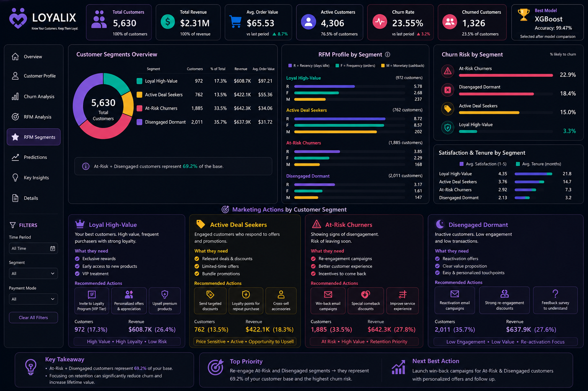

# E-Commerce Customer Analytics
### Customer Segmentation and Churn Prediction

  

## 📌 Project Overview
This project focuses on customer analytics in an e-commerce platform by combining RFM analysis, customer segmentation using clustering techniques, and machine learning models for customer churn prediction.

## 🛠 Technologies Used

- Python
- Pandas
- NumPy
- Scikit-learn
- Matplotlib
- Seaborn
- RFM Analysis
- K-Means Clustering
- DBSCAN
- SMOTETomek
- GridSearchCV

## 🤖 Models Used

- Logistic Regression
- Decision Tree
- Random Forest
- XGBoost ⭐ (Best Model)

## 📂 Dataset

This project includes two versions of the dataset:

- **E Commerce Dataset.xlsx** – Original customer dataset before preprocessing.
- **final_dataset_with_clusters.csv** – Processed dataset after data preprocessing, feature engineering, RFM analysis, and customer segmentation using clustering techniques.

## 📁 Project Files

- `Customer_Segmentation_and_Churn_Prediction.ipynb` — Complete notebook containing data preprocessing, exploratory data analysis (EDA), feature engineering, machine learning modeling, customer segmentation, and evaluation.
- `dashboard.png` — Dashboard preview.
- `E Commerce Dataset.xlsx` — Original customer dataset.
- `final_dataset_with_clusters.csv` — Processed dataset after preprocessing and customer segmentation.
  
## 📊 Project Workflow

1. Data Loading & Preprocessing
2. Exploratory Data Analysis (EDA)
3. Feature Engineering
4. RFM Analysis
5. Customer Segmentation (K-Means & DBSCAN)
6. Model Training
7. Model Evaluation
8. Customer Churn Prediction
9. Interactive Dashboard & Business Insights

## 👩‍🎓 Author
**Mariam Hany**
